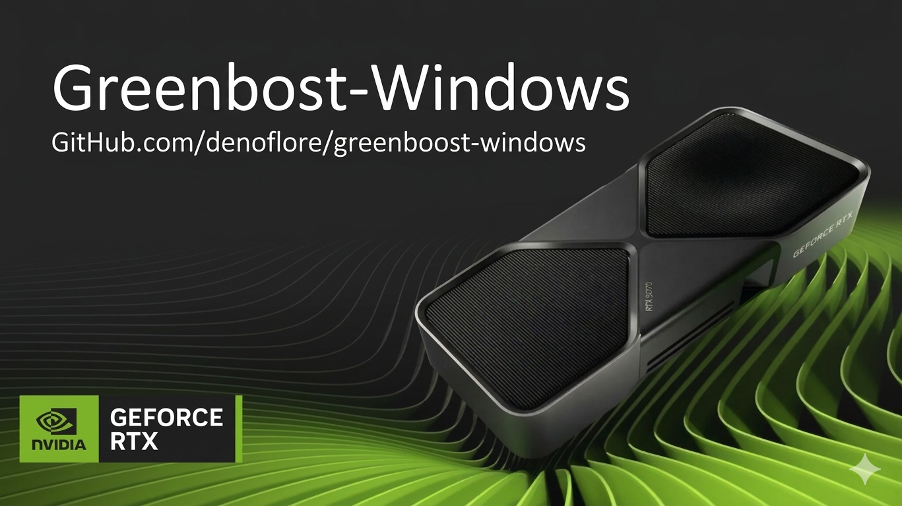

# GreenBoost Windows Port

**Original work by [Ferran Duarri](https://gitlab.com/IsolatedOctopi/nvidia_greenboost) (GPL v2)**

Windows port by [Chris Zuger](https://github.com/denoflore)

---

## The story

I was scrolling Reddit and saw Ferran Duarri's GreenBoost drop on r/LocalLLaMA. A Linux kernel module that transparently extends your GPU's VRAM with system RAM and NVMe so you can run LLMs that don't fit in your card. No code changes to your inference engine, no manual layer offloading, just load the module and your 12GB card suddenly sees 60+ GB of addressable memory. Clever as hell.

My first thought was "that's sick." My second thought was "but I'm on Windows."

I run a multi-GPU homelab with LM Studio on Windows. I've got the VRAM to handle most things, but there's always a bigger model. And plenty of people in the local LLM community are on Windows with a single 12GB or 16GB card who could genuinely use this.

So I figured: why not port it? The original is open source, GPL v2, well-documented. Ferran even published a full architecture doc explaining exactly how the kernel module and CUDA shim work together. The core insight that makes the port possible is that the CUDA memory registration path (`cuMemHostRegister` + `cuMemHostGetDevicePointer`) is identical on both platforms. The only difference is how you get the memory mapped into userspace in the first place.

On Linux: `alloc_pages` -> DMA-BUF fd -> `mmap` -> `cuMemHostRegister`

On Windows: `MmAllocateContiguousMemorySpecifyCache` -> MDL -> `MmMapLockedPagesSpecifyCache` -> `cuMemHostRegister`

Same CUDA calls at the end. Everything else is plumbing.

This is my first actually useful open source contribution. I've got research repos but this is the first piece of practical tooling I've put out there that other people might genuinely benefit from. No deep reason for doing it beyond "someone built something cool for Linux and Windows users deserve it too."

---

## What's in this fork

Everything from Ferran's original repo (untouched, his README preserved as `README_original_ferran.md`) plus a complete `windows-port/` directory:

**Driver** (~1,900 lines)

`driver/greenboost_win.c` -- KMDF kernel driver. Allocates pinned 2MB contiguous blocks, maps into userspace via MDL, monitors RAM/pagefile pressure, manages LRU buffer lifecycle with three-tier eviction.

`driver/greenboost_win.h` -- Device state structs, system information types for memory queries.

`driver/greenboost_ioctl_win.h` -- Windows IOCTL definitions (CTL_CODE). Shared between driver and shim.

`driver/greenboost_win.inf` -- KMDF driver installation manifest.

**CUDA Shim** (~1,450 lines)

`shim/greenboost_cuda_shim_win.c` -- DLL that hooks cudaMalloc/cudaFree via Microsoft Detours. Routes large allocations through CUDA UVM (primary) or driver-mapped pinned pages (fallback). Spoofs VRAM reporting so inference engines see extended memory.

`shim/greenboost_cuda_shim_win.h` -- Fibonacci hash table, config struct, CUDA type stubs, UVM prefetch typedefs.

**Tests** (~530 lines)

`tests/test_ioctl.c` -- 7-test driver interface validation (alloc, free, info, madvise, evict, pin, pressure event).

`tests/test_uvm.c` -- 6-test UVM allocation path validation (interception, memset, free, multi-alloc, VRAM spoofing).

**Tools** (~1,150 lines)

`tools/build.ps1` -- Automated VS2022 + WDK + vcpkg build.
`tools/install.ps1` -- Hardware detection, registry config, driver install.
`tools/sign.ps1` -- Test-signing automation.
`tools/config.ps1` -- Registry configuration utility.
`tools/diagnose.ps1` -- Health check script.

**Build System** (~200 lines)

Three `CMakeLists.txt` files with auto WDK/KMDF version detection, vcpkg Detours discovery, and conditional driver/shim/test targets.

**Docs** (~815 lines)

`BUILDING.md` -- Full build instructions for VS2022 + WDK + vcpkg.
`TROUBLESHOOTING.md` -- Common build and runtime issues.

---

## Memory strategy

The shim uses a two-tier allocation strategy for intercepted CUDA allocations (default threshold: >= 256MB):

**Primary: CUDA Unified Virtual Memory (UVM)**
When available (CUDA 6.0+, compute capability >= 3.0), the shim allocates via `cuMemAllocManaged` and immediately prefetches pages to the GPU with `cuMemPrefetchAsync`. The NVIDIA driver transparently migrates pages between VRAM and system RAM based on access patterns. Weights that fit in physical VRAM are accessed at full HBM bandwidth (~1 TB/s on RTX 4090). Overflow pages spill to RAM and are accessed over PCIe.

**Fallback: Driver-mapped pinned pages**
On older GPUs or if UVM is unavailable, the shim falls back to the kernel driver path: `IOCTL_ALLOC` allocates pinned DDR4 pages, maps them into userspace via MDL, and registers them with CUDA via `cuMemHostRegister(DEVICEMAP)`. This path works universally but all GPU access traverses PCIe (~32 GB/s on Gen4 x16).

UVM capability is probed lazily on the first intercepted allocation (not at DLL load, where no CUDA context exists yet). The fallback path is always available as a safety net.

---

## What changed from the Linux version

The full architecture mapping is documented in `windows-port/CC_INSTRUCTIONS.md`, but here's the summary:

**Memory allocation:** Linux uses `alloc_pages` with compound pages (order 9 = 2MB). Windows uses `MmAllocateContiguousMemorySpecifyCache` for the same 2MB contiguous blocks, with an MDL fallback for when contiguous memory isn't available.

**Sharing memory with userspace:** This was the trickiest part and where the first implementation had a critical bug. The original attempt used `ZwCreateSection` to create an NT section object, but `ZwCreateSection` with a NULL file handle creates anonymous pagefile-backed memory -- completely separate from the pinned physical pages we allocated. The shim would have gotten the wrong memory entirely. The fix uses `MmMapLockedPagesSpecifyCache(UserMode)` which maps the actual physical pages described by the MDL directly into the calling process. This is the true Windows equivalent of Linux `mmap(dma_buf_fd)`.

**GPU memory path:** Linux relies on DMA-BUF + HMM for transparent page migration between VRAM and RAM. Windows has no kernel-level equivalent, so the shim uses CUDA Unified Virtual Memory (UVM) to let the NVIDIA driver handle page migration. This is the closest Windows equivalent and delivers near-native VRAM bandwidth for hot pages.

**Buffer lifecycle:** Linux relies on `close(fd)` triggering the DMA-BUF release callback for automatic cleanup. Windows has no equivalent for MDL user mappings, so we added an explicit `GB_IOCTL_FREE` that the shim calls on `cudaFree`. The driver tracks the owning process so it can do cross-process cleanup via `KeStackAttachProcess` if needed during driver unload.

**CUDA hook injection:** Linux uses `LD_PRELOAD` + a `dlsym` intercept (because Ollama resolves symbols via `dlopen` internally). Windows uses Microsoft Detours (MIT licensed) for API hooking, with an IAT patching fallback.

**Hash table bug fix:** The original Linux `ht_remove` zeroes deleted slots with `memset(e, 0, sizeof(*e))`, which breaks open-addressing probe chains. A lookup for a key that hashed past the deleted slot would stop early at the zeroed slot and miss the target. The Windows port uses tombstone markers instead, which preserves probe chain integrity. This is a bug in the upstream Linux code too.

**Registry reading:** Uses `ZwOpenKey`/`ZwQueryValueKey` with absolute registry path (`Services\GreenBoost\Parameters`) instead of WDF registry helpers, for reliability at early driver init before the framework is fully set up.

**Memory queries:** `MmAvailablePages` (an exported kernel variable not reliably available across WDK versions) replaced with `ZwQuerySystemInformation(SystemPerformanceInformation)`.

**Watchdog:** Linux `kthread` becomes `PsCreateSystemThread`. Linux `eventfd` becomes a named kernel event (`\BaseNamedObjects\GreenBoostPressure`). Memory pressure queries use `ZwQuerySystemInformation` instead of `/proc/meminfo`.

---

## Status

**Built and community-tested.** The driver and shim have been compiled on Win11 + VS2022 + WDK and tested with dynamic injection into Python processes (ComfyUI). Build automation scripts are included. The UVM allocation path is implemented and the test suite passes.

Known limitations:
- Inference speed with the driver fallback path (non-UVM) is significantly slower due to PCIe bandwidth constraints. UVM path recommended for all modern GPUs.
- Test signing required for driver installation (standard for development).
- Not yet tested with Driver Verifier for production hardening.

Contributions welcome. See open issues for areas that could use help.

---

## Building

Prerequisites: Visual Studio 2022, Windows Driver Kit (WDK), CMake 3.20+, vcpkg with Microsoft Detours.

See `windows-port/BUILDING.md` for full instructions, or use the automated build script:

```powershell
.\windows-port\build.ps1
```

---

## The original

All credit to **Ferran Duarri** for the original GreenBoost architecture and implementation. The Linux source in this repo is unmodified from the [upstream GitLab repository](https://gitlab.com/IsolatedOctopi/nvidia_greenboost). He did the hard work of figuring out the DMA-BUF + CUDA external memory integration, the 3-tier memory hierarchy, the Ollama-specific dlsym hooks, and all the system tuning. This port just translates his design to Windows APIs.

Thanks Ferran. Hope this is useful to the Windows side of the community.

---

## License

GPL v2, matching upstream. Attribution to Ferran Duarri required per license terms.

```
Original work: Copyright (C) 2024-2026 Ferran Duarri
Windows port: Copyright (C) 2026 Chris Zuger
SPDX-License-Identifier: GPL-2.0-only
```

